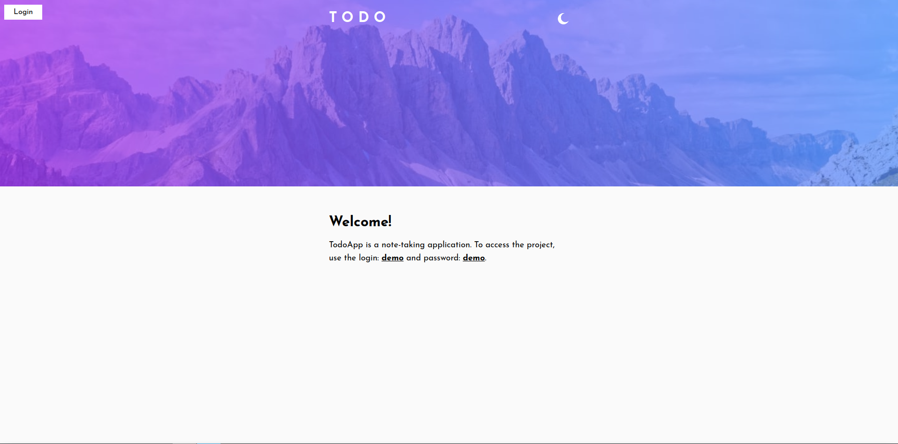
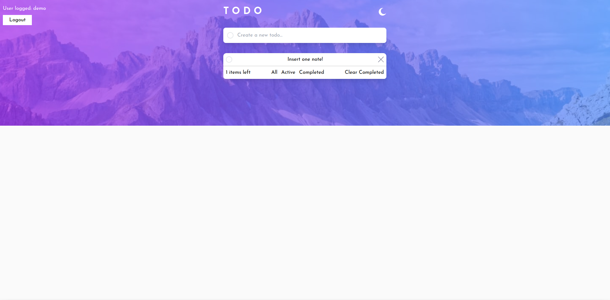
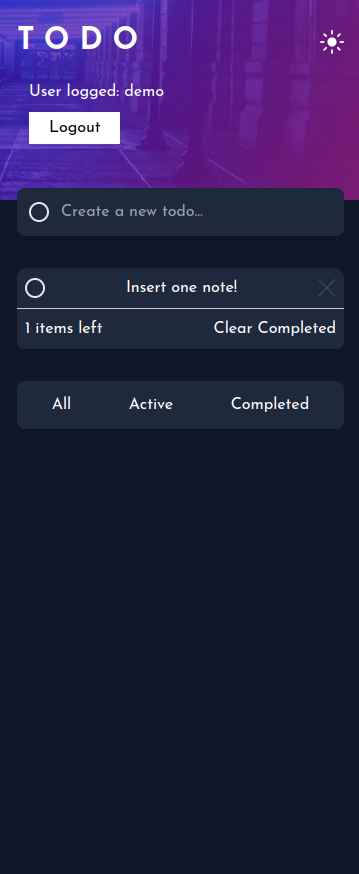
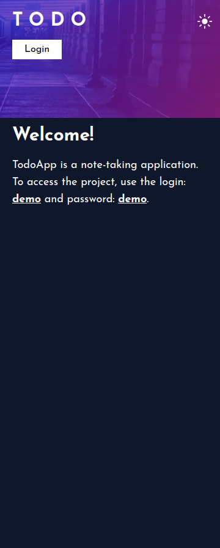

# Todo app

The classic todo app with a few twists! This app includes a dark/light theme toggle and drag & drop reordering for anyone wanting an extra test.

## Table of contents

- [The challenge](#the-challenge)
- [Screenshot](#screenshot)
- [Links](#links)
- [My process](#my-process)

### The challenge

- Add new todos to the list
- Mark todos as complete
- Delete todos from the list
- Filter by all/active/complete todos
- Clear all completed todos
- Toggle light and dark mode
- View the optimal layout for the app depending on their device's screen size
- See hover states for all interactive elements on the page
- Bonus: Drag and drop to reorder items on the list
- Bonus: Build this project as a full-stack application

### Screenshot

### Links

- Solution URL: https://github.com/Genildocs/todoapp
- Live Site URL: https://todoapp-topaz-psi.vercel.app/
- api URL: https://github.com/Genildocs/notesback

### Built with

- Semantic HTML5 markup
- CSS custom properties
- Flexbox
- CSS Grid
- [React](https://reactjs.org/) - JS library
- [Vite.js](https://vitejs.dev/) - React framework
- [Tailwind](https://tailwindui.com/) - For styles
- [Framer Motion.](https://www.framer.com/motion/) - For styles
- [Expressjs](https://expressjs.com/) - backend

### What I learned

- Usage of `Express.js` for creating the backend, where a CRUD API for notes was implemented. `MongoDB` and `Mongoose` were used.

## Author

- GitHub - https://github.com/Genildocs
- Linkedin - https://www.linkedin.com/in/genildo-cerqueira-91888786/
